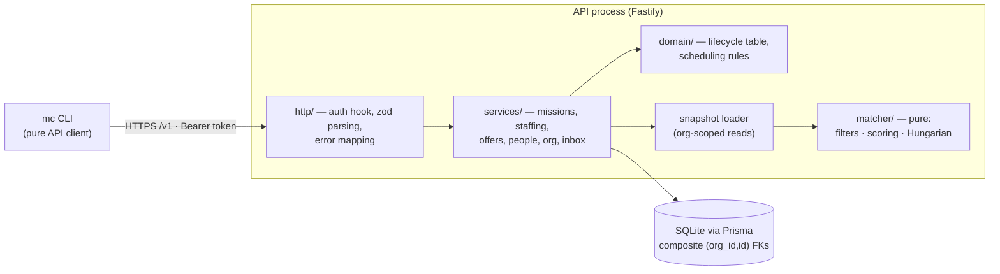
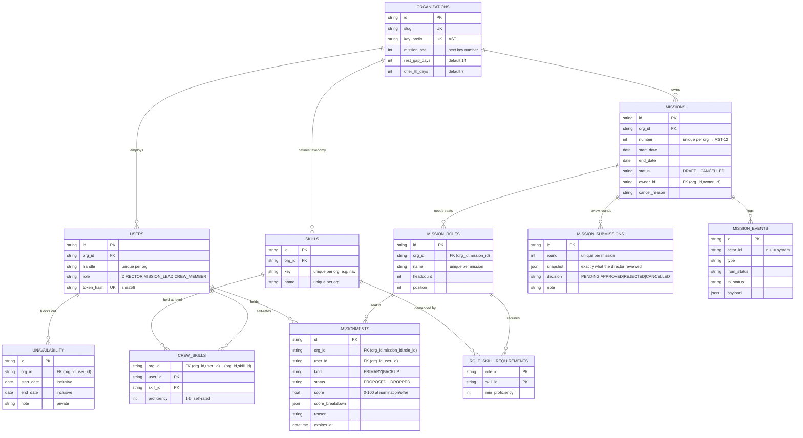
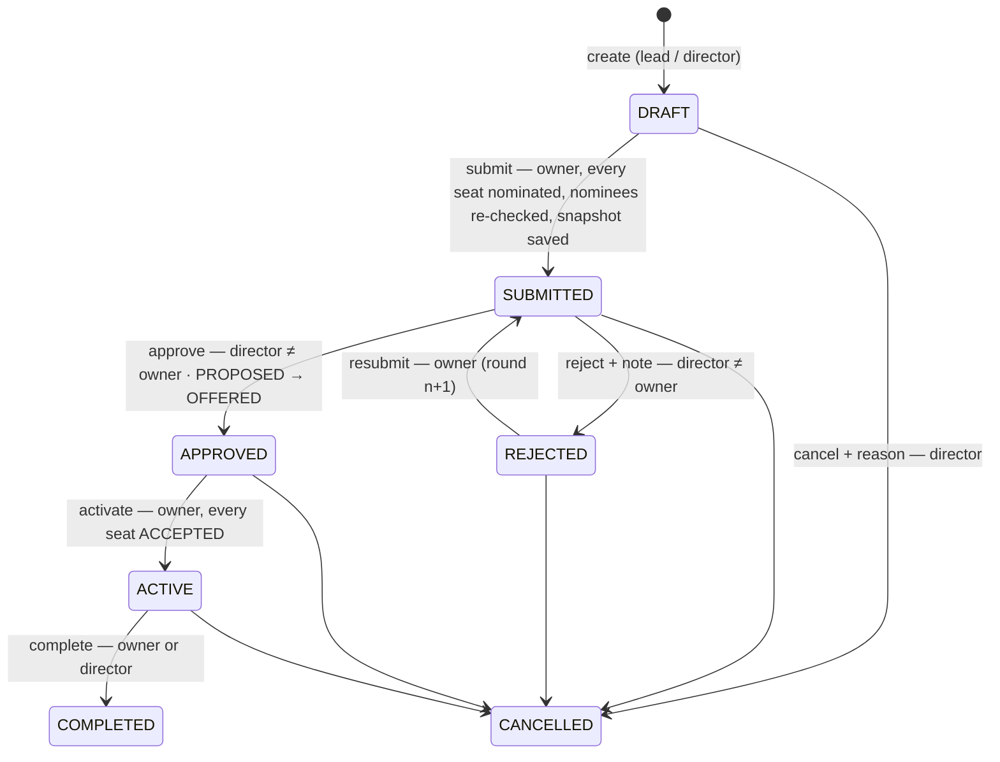
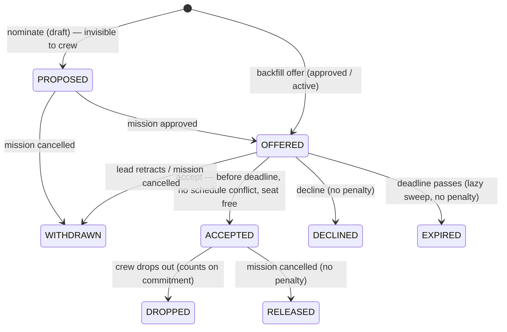
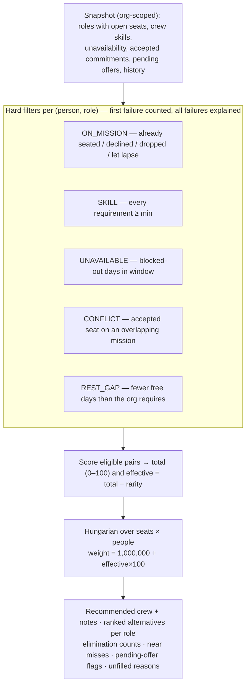

# Mission Control — Design Document

**Status:** v2 — revised after design review · **Date:** 2026-09-28 · **Author:** Shubh · **Audience:** engineering team and AI coding agent

> Multi-tenant crew assignment platform for space organisations: an API and a CLI.

### Revision history

| Version | What changed | Why |
| --- | --- | --- |
| v1 (`cdab97d`) | Initial design. | — |
| **v2** | Requirements moved from mission-level skills to **roles**. Matching became a joint **seat assignment (Hungarian)** with a **rarity** penalty. Workload is measured over a **±90-day horizon**, plus a per-org **rest gap**. **Offers are sent only after approval** (nominations stay hidden until then). **Directors-only approval.** **Commitment** (drop-outs only) replaced reliability. Roster is **visible to crew once the mission is active**. **Composite `(org_id, id)` foreign keys.** Lifecycle and permissions written **as data**. Offer **deadlines** with lazy expiry. **Human-readable keys** and **CLI profiles**. | The design review found contradictions an agent would resolve by guessing: filter F2 ("hold all skills") conflicted with per-skill headcount; the workload score could never vary because F4 already removed every overlap; offers sent in DRAFT could be accepted for missions that were then rejected, and replacing requirements orphaned them. v1 also left out a stated brief requirement: orgs differ in approval processes. Each change is recorded as a decision below, grounded in how real crew assignment works (§3). |

Work beyond this slice is tracked in [TODO.md](./TODO.md) (next, after the happy path) and [ROADMAP.md](./ROADMAP.md) (v2/v3, including the full catalogue of approval modes).

---

## 1. Problem statement

Space organisations plan missions that need specific crew capabilities. Today assignment is manual and error-prone: leads cross-reference skill profiles, availability calendars and existing commitments by hand. Many organisations will share the platform, each with its own crew size, skill taxonomy, rules and approval process.

**Mission Control** lets an organisation:
- manage its crew (skills, availability, history);
- plan missions as a set of **roles**, each needing specific skills;
- get **explainable** crew recommendations from a matching engine that fills every seat jointly;
- move missions through a director-approval gate;
- offer seats to crew, who accept or decline;
- repair seats that open up after approval without re-planning.

All of this runs behind a versioned API and a CLI. Tenant isolation and role-based access are enforced on the server, down to the database constraints.

## 2. Goals and non-goals

**Goals**
- Multi-tenant API with three roles (Director, Mission Lead, Crew Member). Access control is enforced server-side, and tenancy is enforced by the database itself.
- A mission lifecycle with an approval gate: the director approves the **plan and the named crew**; offers go out only after approval.
- Crew management: per-org skill taxonomy, self-rated proficiency (1–5), unavailability windows, assignment history.
- A deterministic, explainable matcher:
  - hard filters;
  - weighted scoring;
  - joint seat assignment (Hungarian);
  - a rarity penalty;
  - for every decision, the elimination counts, near misses and a note explaining it.
- A CLI through which every primary workflow can be run, with role-aware guidance (`mc inbox`, "Next:" hints).
- Seed data for two organisations with different taxonomies and settings. It includes missions in every state and a staged draft that shows the engine's judgement.
- Automated tests for the matcher, lifecycle, permissions, tenancy and end-to-end workflows, plus a scripted CLI demo that doubles as a smoke test.

**Non-goals (deferred — see ROADMAP.md)**
- Web interface (not required by the brief).
- Email/webhook notifications. The **inbox is derived from state**; delivery is an outbox on the roadmap.
- Configurable approval modes (peer review, N-of-M, risk tiers). v1 ships one policy (D5), and the roadmap catalogues the rest.
- Lead-verified skill ratings and backup crew (next up, in TODO.md). The schema is ready for backups.
- Rescheduling after approval (launch slips), certification expiry, cross-mission optimisation, multi-org users, SSO.

## 3. How real crew assignment works (and what we took from it)

| Real practice | What it means for the design |
| --- | --- |
| The Astronaut Office picks the crew that gives the mission the best chance of success. Candidates must be **unassigned to other missions and available** (not on leave). | Hard filters: skills, unavailability, no overlapping commitment. |
| On ISS missions a multi-agency panel decides **who flies and in which role** (commander, spacewalks, robotics), by consensus. | Missions are made of **roles**. Approval covers the named crew. Multi-party approval is a documented roadmap mode. |
| **Prime and backup crews are selected together**; backups train alongside and step in if needed. | Assignments carry `kind = PRIMARY \| BACKUP` (schema-ready). Backup nomination is next (TODO.md). |
| Crews are assigned **well in advance so they train together**. | The roster is revealed to crew once the crew is locked (ACTIVE), not at launch. |
| **14-day pre-flight quarantine**; **45 days of post-flight reconditioning**. | A **rest gap** between missions (per-org setting, default 14 days). Offers must be answered before the quarantine window. |
| Agencies *assign* crew; they don't *offer* seats. | **A deliberate difference:** a B2B platform serving private companies, labs and contractors needs consent, so seats are offered and crew accept. A direct-assignment mode is on the roadmap. |

Sources: [ESA — assigning an astronaut to a mission](https://www.esa.int/Science_Exploration/Human_and_Robotic_Exploration/Astronauts/Assigning_an_astronaut_to_a_mission) · [NASA — Artemis II backup crew](https://www.nasa.gov/news-release/nasa-announces-its-artemis-ii-backup-crew-member-for-moon-mission/) · [NASA Health Stabilization Program outcomes](https://pmc.ncbi.nlm.nih.gov/articles/PMC13407858/) · [CNN — Artemis crew selection](https://www.cnn.com/2023/01/29/world/nasa-artemis-moon-secretive-crew-selection-process).

## 4. Tech stack

| Layer | Choice | Why |
| --- | --- | --- |
| Language | TypeScript on Node ≥ 22.12 | One language for API and CLI. The CLI imports the server's response types, so they cannot drift. |
| API | Fastify 5 | Fast, typed, and its `inject()` makes integration tests cheap. |
| Validation | zod 4 | Request shape validation at the edge; business rules stay in services. |
| ORM / DB | Prisma 6 + SQLite | Runs locally with no infrastructure. Real enums, JSON columns and composite foreign keys. Swapping the datasource to Postgres / Cloud SQL is the production path. Prisma 7 was tried and rolled back (it needs a new config file plus driver adapters — friction for a 3–5 h slice). |
| CLI | Commander 15, run through `tsx` | Subcommand tree mirrors the API. `bin/mc.mjs` runs the TypeScript directly (no build step). |
| Tests | Vitest 5 | Unit tests for pure logic; integration tests on a copied, migrated SQLite template per file. |

## 5. Decision log

**D1 — TypeScript end-to-end.** API and CLI share types. The CLI imports the services' view types (`MissionView`, `MatchResponse`), so a response shape change breaks the CLI build, not the user. *Rejected:* Python — equally viable, but splits the type system.

**D2 — Per-org skill taxonomy; requirements live on roles.** `skills` is org-scoped, and each skill has a short CLI key (`nav`) and a display name. A mission has **roles** (`Pilot ×1`, `Flight Engineer ×2`), and each role lists the skills it needs with a minimum level. A person is eligible for a role only if they meet every requirement of that role. This covers both readings the brief allows: one role needing several skills, or several single-skill roles. It also matches how crews are actually structured. *Rejected (v1):* per-skill headcount with "must hold all mission skills". It contradicted itself: a navigator slot would have required EVA too.

**D3 — Single `users` table, hierarchical role.** `role ∈ {DIRECTOR, MISSION_LEAD, CREW_MEMBER}`, ordered DIRECTOR ⊃ MISSION_LEAD ⊃ CREW_MEMBER. **Only crew members are matchable**: role is about permissions, not flight status. Leads and directors who also fly get a "flies" flag, independent of role (TODO.md §6).

**D4 — Token auth; org always derived from the token; tokens hashed.** Each request resolves `Bearer <token>` → `sha256` → user, org and role. The org is **never** taken from the request (bodies are strict, so an `orgId` field is rejected outright). Tokens are stored only as digests. *Later:* expiry, rotation, scopes, SSO.

**D5 — Approval: directors only, never their own mission.** *Revised from v1*, where a director or any lead other than the creator could approve.
- **Why directors only:** leads lack a director's authority and accountability. Peer approval also invites a "syndicate" — leads approving each other's missions — which defeats separation of duties.
- **Why "never their own mission":** it closes the same hole for directors. A mission created by a director needs a different director.
- **Brief compatibility:** the brief's clause that leads cannot approve their own missions still holds, trivially. Peer review, N-of-M, risk tiers and sequential chains are catalogued in ROADMAP.md with the data model that supports them.

The director has exactly three outcomes:
- **approve:** offers go out;
- **reject with a note:** the lead edits and resubmits, and the history is kept;
- **cancel:** the mission is scrapped.

**D6 — A deterministic, explainable matcher as a pure function.** The service loads an org-scoped snapshot; `runMatch(snapshot)` does no I/O. Filtering happens **in memory, not in SQL**, so the per-filter elimination counts, near misses and "why not X?" all fall out naturally, and unit tests need no database. Same input → same crew. *Rejected:* SQL filters (awkward to explain failure); ML (unexplainable, unjustified at this scale). *Scale note:* thousands of crew × tens of seats is milliseconds. If orgs grow much larger, pre-filter candidates by skill in SQL.

**D7 — Repair the seat, not the mission.** A decline, expiry or drop-out after approval reopens **one seat**; the mission stays APPROVED or ACTIVE. The lead backfills with a direct offer and **no re-approval**: swapping a person inside an approved plan is operations, not policy. Changing the plan itself (dates, roles) is a roadmap item (reschedule), and it would require re-approval.

**D8 — The audit log is a first-class table.** `mission_events` records every transition and offer action (actor or *system*, from→to, JSON payload). It drives `mc missions history`.

**D9 — Offers only after approval; nominations are invisible.** In a draft, the lead nominates crew. These are `PROPOSED` seats that crew cannot see at all.
- **Submit:** re-checks every nominee against the hard filters and saves a **snapshot** (plan, nominees, scores) exactly as the director will see it.
- **Approve:** turns every `PROPOSED` seat into `OFFERED`.

This matches the real process (leadership approves named crew), stops crew accepting missions that are later rejected, and means requirements are locked before any offer exists.

**D10 — Fill every seat jointly: the most seats first, then the best quality.** Roles become seats (headcount 2 → two seats). Every eligible (seat, person) pair gets weight `1,000,000 + round(effective score × 100)`, and a maximum-weight assignment (Hungarian, O(n²m)) picks the crew. The bonus is larger than any possible quality difference, so the optimiser **first fills as many seats as possible, then maximises total quality**. This avoids the greedy trap, where the best pilot is also the only possible engineer. *Rejected:* role-by-role greedy (leaves avoidable gaps); hardest-role-first (usually right, not always).

**D11 — Rarity penalty: keep scarce people free.** For each skill a person holds at level 4+ that **this role does not need**, add `1 / (org crew holding it at 4+)`, capped at 1. Up to **5 points** come off the score used to rank. Close candidates therefore favour whoever is less versatile, and a clearly better candidate (by more than 5 points) still wins. It is a cheap stand-in for cross-mission optimisation (roadmap). The raw score is always shown next to the adjusted one.

**D12 — Workload over a horizon, plus a rest gap.** Missions are exclusive: nobody flies two at once (hard filter). A **rest gap** is also a hard filter: the org's minimum number of free days between two missions (default 14, from pre-flight quarantine). Workload is measured over **±90 days around the mission**:
- `workload = 1 − committed mission-days in horizon / horizon length`.

*Rejected (v1):* workload measured only inside the window, which was always 1.0 after the overlap filter, plus a "≤ 2 concurrent missions" cap that could never trigger.

**D13 — Commitment, not reliability.** Only **drop-outs after accepting** count; declines, expiries and cancellations never do. The score is smoothed so one incident doesn't zero anyone:
- `commitment = (accepts − dropouts + 2) / (accepts + 2)`
- a new crew member scores 1.0; one drop-out from one accept scores 0.67.

Its weight is only 10%.

**D14 — Crew see only their own seat until the crew is locked.** Crew never see who else was offered, ranked, declined or scored. Crew never see scores at all, including their own, which would invite gaming and disputes. Once a mission is **ACTIVE** (every seat accepted and the crew locked), confirmed crew see the roster (names and roles). Real crews train together, so hiding the roster until launch would be unrealistic. The concern was bias during *selection*, and that phase stays blind.

**D15 — Tenancy enforced by the database.** Every tenant-owned table has `org_id`. Every relation between tenant-owned rows is a **composite foreign key on `(org_id, id)`**; assignments go further and reference their role as `(org_id, mission_id, role_id)`. A row cannot point at another org's user, skill or mission — SQLite rejects it (there is a test for this). On top of that, services scope every query by the caller's org, and another org's keys resolve as *not found* (404, never 403 — existence is not confirmed).

**D16 — Lifecycle and permissions as data.** One table (`src/domain/lifecycle.ts`) lists, for each action: allowed states → target state, who may do it, the error verb and the hint text. That same table drives:
- enforcement (`assertMissionAction`);
- the `allowedActions` list in every mission response, which the CLI turns into "You can…" and "Next:";
- a test that walks every status × action × actor combination.

State changes use **compare-and-set** (`UPDATE … WHERE status IN (…)`), so two concurrent approvals cannot both succeed.

**D17 — Offers have deadlines; several offers are fine, double booking is not.**
- **Deadline:** `min(offer time + org TTL, launch − 14 days)`, and never less than 24 h away. It is evaluated lazily: every read or write sweeps overdue offers to `EXPIRED` and logs the event, so there is no scheduler.
- **Several offers:** crew may hold several pending offers, even for overlapping missions.
- **No double booking:** **accepting** re-runs the same schedule rules the matcher uses, inside the transaction.
- **Switching:** drop out of the first mission (recorded as a drop-out there, and the lead is told), then accept the second.
- **Blocked offers:** the other lead sees only "Candidate is no longer available for these dates", never *why*. The crew member sees the specific conflict.

**D18 — Self-rated skills in v1.** Crew set their own levels, because the brief says crew manage their own profiles. Lead or director verification (a `verified_rating` the matcher prefers) is the first TODO item. The risk of self-rating is acknowledged.

**D19 — Cancellation: directors only; everyone affected is told.** Cancelling needs a reason and works from any non-terminal state. Open offers become `WITHDRAWN` and accepted seats `RELEASED` (no penalty), each tagged "Mission cancelled: …". Crew see this in their inbox. There is no notifications table: the inbox is derived from assignment status plus reason.

**D20 — Human-readable keys and CLI profiles.** Missions are `AST-12` (per-org prefix and sequence). Crew are referenced by handle and skills by key. The CLI keeps one profile per identity and switches with `mc use ava@astra`, because evaluators and real users constantly switch between director, lead and crew.

## 6. Architecture



```
src/
  lib/        dates (inclusive day ranges), errors, clock, token hashing
  domain/     lifecycle.ts (rules as data), scheduling.ts (shared conflict/rest rules), types, events
  matcher/    hungarian.ts, scoring.ts (all weights as constants), matcher.ts (pipeline + explanations)
  services/   one module per area; every query scoped by ctx.actor.orgId
  http/       app.ts (auth, errors), validation.ts (zod), routes/
  cli/        index.ts, ui.ts (tables, badges, bars), config.ts (profiles), client.ts, commands/
prisma/       schema, migrations, seed (uses the real services for current missions)
tests/        unit/ (pure) · integration/ (real app via inject) · support/
scripts/      setup.mjs, demo.ts (26-step CLI walkthrough and smoke test)
```

**Principles:**
- Controllers are thin: parse, build context, call one service.
- Business rules live in services and domain; the matcher is pure.
- The CLI never decides anything: it renders, suggests the next step, and maps failures to exit codes.
- *v1 divergence:* there is no separate repository layer. Prisma is the repository, and scoping is enforced by every service query plus the composite FKs.

## 7. Tenancy and authentication

- `Authorization: Bearer <token>` → `sha256` lookup → `{ userId, orgId, role, handle, org }`. A missing or unknown token returns 401.
- The org comes only from the token. Request bodies are strict objects, so unexpected fields such as `orgId` are rejected.
- Isolation in layers:
  1. Composite FKs make cross-tenant rows impossible in the database.
  2. Every service query filters by `orgId`.
  3. Mission keys resolve only inside the caller's org (`LUN-1` from an Astra token → 404).
  4. IDs are cuids, not guessable.
- Tests cover reads, the **write path** (another org's skill key or crew handle in a request), matcher candidates, and a direct database insert that must fail.

## 8. Roles and permissions

| Capability | Crew | Mission Lead | Director |
| --- | --- | --- | --- |
| Own profile: skills (self-rated), unavailability | ✓ | ✓ | ✓ |
| Crew directory, other people's profiles | self only | ✓ | ✓ (+ private notes) |
| Skill taxonomy — read / add | read | read | read / add |
| Org settings — read / change | read | read | read / change |
| Create a mission | – | ✓ | ✓ |
| Edit, set roles, nominate, submit (draft / changes requested) | – | **owner** | **owner** |
| Run the matcher (dry run) | – | ✓ | ✓ |
| Approve / reject | – | – | ✓ **not own** |
| Cancel (any non-terminal state) | – | – | ✓ |
| Backfill offers / retract (approved, active) | – | **owner** | **owner** |
| Activate (every seat accepted) | – | **owner** | **owner** |
| Complete | – | **owner** | ✓ |
| Respond to own offers: accept / decline / drop out | ✓ | – | – |
| Mission audit history | – | ✓ | ✓ |
| See a mission | offered missions only | ✓ | ✓ |

The mission rows come straight from `MISSION_RULES` (D16). Errors are specific:
- 403 `FORBIDDEN` — for example "Only the mission's owner can edit this mission.";
- 403 `CANNOT_APPROVE_OWN`;
- 409 `INVALID_TRANSITION`;
- 404 for anything outside the caller's view.

## 9. Data model



**Notes**
- **Dates** are calendar dates stored as UTC midnight. Ranges are **inclusive** (Nov 1–30 = 30 days). Overlap: `a.start ≤ b.end ∧ b.start ≤ a.end`. Gap = free days strictly between two ranges. All in `src/lib/dates.ts`.
- **Unavailability** is opt-out: crew are available by default. Accepted seats count as commitments. Notes are private: leads see only dates.
- A **seat is open** when `headcount − live primaries (PROPOSED/OFFERED/ACCEPTED)` is above zero. This is derived, never stored, so it cannot drift.
- **Closed assignments are never deleted** (declined, expired, dropped). They are the history the matcher uses (exclusions, commitment, experience). The only rows ever deleted are `PROPOSED` drafts, when a nomination is removed or roles are redefined.
- **Why a second migration:** the committed `init` migration was not edited. `20260928095500_roles_nominations_tenancy` reshapes the pre-release schema, and dev databases are rebuilt with `npm run setup`.
- **Prisma note:** Prisma 6 emits an invalid SQLite default for `Json` columns, so the app always writes `payload` explicitly instead of relying on a database default.

## 10. Mission lifecycle



| Transition | Guards (service, inside one transaction) | Side effects |
| --- | --- | --- |
| create → DRAFT | lead+; start after today; end ≥ start; role skills exist in *this* org | next key from `mission_seq` |
| edit / roles / nominate | owner; DRAFT or REJECTED | redefining roles deletes `PROPOSED` seats (reported) |
| → SUBMITTED | ≥ 1 role; every seat nominated; start still in the future; **every nominee still eligible** | submission round with snapshot; nominee scores refreshed |
| → APPROVED | director who is not the owner | decision recorded; all `PROPOSED` → `OFFERED` with a deadline |
| → REJECTED | director who is not the owner; **note required** | decision + note; nominations kept for editing |
| → CANCELLED | director; **reason required** | `PROPOSED`/`OFFERED` → `WITHDRAWN`, `ACCEPTED` → `RELEASED`, tagged with the reason; a pending submission is marked `CANCELLED` |
| → ACTIVE | owner; every role's accepted primaries = headcount | roster becomes visible to confirmed crew |
| → COMPLETED | owner or director | accepted seats become experience |

## 11. Assignment lifecycle



- Responses are idempotent-safe. Only `OFFERED` can be answered; anything else returns `ALREADY_RESPONDED`, `OFFER_EXPIRED` or `INVALID_TRANSITION` (409).
- Declined, dropped and expired crew are excluded from later matches **for that mission**. Withdrawn and released crew may be considered again.

## 12. Matching engine



**Scoring** (`src/matcher/scoring.ts`; every constant is named):

```
score      = 100 × (0.45·skill + 0.25·workload + 0.20·experience + 0.10·commitment)
skill      = mean(level / 5) over the role's required skills
workload   = 1 − committed mission-days within ±90 days of the mission / horizon length
experience = min(1, completed missions in a role that used any of these skills / 5)
commitment = (accepts − dropouts + 2) / (accepts + 2)
rarity     = min(1, Σ over level-4+ skills the role doesn't need of 1 / holders)   → effective = score − 5·rarity
```

**Why weights, not a fixed rank order?** Skill dominates, because the mission has to succeed. Workload spreads effort and guards against burnout. Experience rewards relevant history. Commitment is a small tie-breaker. Hard safety rules (skills, availability, rest) are filters, never trade-offs.

**Worked examples** — each is also an automated test or seed scenario:

1. **The greedy trap** (unit test). Pilot needs Orbital Navigation ≥ 4; Engineer needs EVA ≥ 3. A has nav 5 and EVA 4; B has nav 4 only.
   - Greedy seats A as Pilot (80.0), and the Engineer seat stays empty.
   - The optimiser seats **B as Pilot and A as Engineer**, and notes: *"A scores higher here (80.0) but is needed as Engineer so every seat fills."*
2. **Rarity** (unit test). A has nav 5, the org's only EVA-5, and one relevant mission: **84.0 raw, −5 → 79.0**. C has nav 5 and nothing rare: **80.0**.
   - **C is picked**, with the note *"A scores higher (84.0) but is kept free: rare EVA Ops (only holder)"*.
   - With three relevant missions, A scores 92.0 → 87.0 and **wins**: clearly better beats rare.
3. **Workload** (unit test). B returns 20 days after the mission for 42 days. `1 − 42/210 = 0.80`, against 1.00 for someone free. v1's formula scored both 1.0.
4. **The seed draft `AST-6 Europa Survey`** (`mc missions match AST-6`):
   - **Pilot:** Yuki 75.0, because Leo (86.2 as pilot) is the only person who can fill Flight Engineer (64.7).
   - **Mission Specialist:** Jamal 79.7 over Tomás (84.0 raw → 79.0), who holds the org's only Flight Medicine qualification.
   - **Excluded:** Elena by the **rest gap** (5 days after her current mission), Amara by a **conflict**, Dmitri as **unavailable**.
   - **Near miss:** Sara (Orbital Navigation 3 of 4).
   - **Flagged, not excluded:** Jamal, for a **pending offer on an overlapping mission**.

**Explainability**
- `mc missions match <key>`: the recommended crew with a note wherever it differs from the naive pick, component bars, the top alternatives per role, elimination counts and near misses. For a seat nobody can fill, the reason (e.g. *"no eligible crew (3 lack the skills, 1 committed elsewhere, 1 inside the rest gap)"*).
- `mc missions match <key> --explain <handle>`: every role, eligible or not, every failed rule, the rank, and the full breakdown with its facts (e.g. "15 of 210 days committed").

## 13. Offers, deadlines and conflicts

- **Deadline:** `min(now + org offer TTL, launch − 14 days)`, never under 24 h. Shown to crew as "respond by … (in 3 days)".
- **Lazy expiry:** listing offers, the inbox, match, show and every offer action first sweep overdue offers to `EXPIRED`, recording a *system* event.
- **Accept** re-checks, in one transaction:
  - the offer is still open and the mission is taking responses;
  - no overlapping accepted seat;
  - the rest gap is respected;
  - no unavailability in the window;
  - the role still has a free seat.
- **Unavailability** cannot be added over days you are committed to. The error tells you to drop out explicitly instead.
- **Blocked offers:** the lead's view and inbox flag them ("no longer available for these dates") with `mc missions retract` as the next step.

## 14. Visibility rules (who sees what)

| | Crew | Lead / Director |
| --- | --- | --- |
| Nominations (`PROPOSED`) | never | ✓ |
| Own offer: role, dates, deadline, blocked reason | ✓ | ✓ |
| Other crew on the mission | **only once ACTIVE**, and only if confirmed: names and roles | ✓ |
| Scores and breakdowns | **never**, including their own | ✓ |
| Who else was offered, declined or ranked | never | ✓ |
| Why another lead's candidate is blocked | — | "no longer available" only |
| Unavailability notes | own | directors only (leads see dates) |
| Audit history | – | ✓ |

## 15. Edge cases handled

- **Rejected → revise → resubmit:** the note is shown in the lead's inbox. Round n+1 keeps the full history. Nominations stay editable.
- **Decline / expiry / drop-out after approval:** the seat reopens. The lead's inbox shows *"1 open seat — Sara declined"*. The matcher excludes that person for this mission. A backfill offer needs no re-approval (D7).
- **Nobody can fill a seat:** the matcher says why (elimination counts) and who is close (near misses). It never returns a silent empty list.
- **Two overlapping offers:** both can be held, but only one accepted. Switching is an explicit drop-out plus accept.
- **Concurrent state changes:** compare-and-set updates. The loser gets `INVALID_TRANSITION` and "reload and try again".
- **Director created the mission:** another director must review it (`CANNOT_APPROVE_OWN`).
- **Cancelled with live offers:** all withdrawn or released in the same transaction, with the reason shown to crew.
- **Dates change on a draft:** nominees are re-checked at submit. Redefining roles clears nominations and says so.
- **Cross-tenant access:** 404 for keys, handles and skills from other orgs. Rows linking two orgs are rejected by the database.

## 16. API surface

Base `/v1`. `Authorization: Bearer <token>`. Errors are always `{ "error": { "code", "message", "details"? } }`: 400 validation, 401, 403, 404, 409 state/conflict, 422 precondition/not eligible.

| Endpoint | Who | Purpose |
| --- | --- | --- |
| `GET /health` | anyone | liveness + DB |
| `GET /me` · `GET /inbox` | any | identity; role-aware action items |
| `GET /me/profile` · `PUT /me/skills` · `DELETE /me/skills/:key` | any | own profile, self-rated skills |
| `GET/POST /me/unavailability` · `DELETE /me/unavailability/:id` | any | blocked-out days |
| `GET /me/offers` · `POST /me/offers/:key/accept\|decline\|drop` | crew | respond to seats |
| `GET /org/settings` · `PATCH /org/settings` | any · director | rest gap, offer TTL |
| `GET /skills` · `POST /skills` | any · director | taxonomy |
| `GET /crew?skill=&min=` · `GET /crew/:handle` | lead+ (crew: self) | directory |
| `GET /missions?status=&mine=` · `POST /missions` | any (scoped) · lead+ | list / create |
| `GET /missions/:key` · `PATCH /missions/:key` · `PUT /missions/:key/roles` | scoped · owner | view (`allowedActions` included) / edit |
| `GET /missions/:key/match?explain=` | lead+ | dry-run matcher |
| `POST /missions/:key/nominations` · `DELETE /missions/:key/nominations/:handle` | owner (draft) | `{recommended:true}` or `{role, crew}` |
| `POST /missions/:key/submit\|approve\|reject\|cancel\|activate\|complete` | per D16 | lifecycle |
| `POST /missions/:key/offers` · `POST /missions/:key/offers/:handle/retract` | owner (approved/active) | backfill / retract |
| `GET /missions/:key/events` | lead+ | audit trail |

## 17. CLI

`mc` (via `npm link`, or `npm run mc -- …`). Profiles live in `~/.mission-control/config.json`.

```
mc login <token> [--as name]      mc use <profile>      mc profiles      mc whoami      mc inbox

mc missions list [--status draft,approved] [--mine]     mc missions show <key>
mc missions create -t … --start … --end … [--role "Pilot:1:nav=4"]…
mc missions edit <key> [--title|--start|--end|--description]
mc missions roles set <key> --role "Flight Engineer:2:eva=4,comms=3" …
mc missions match <key> [--explain <handle>] [--all]
mc missions nominate <key> --recommended | --role <r> --crew <h> [--reset]     mc missions unnominate <key> <h>
mc missions submit <key>        mc missions approve <key> [--note]      mc missions reject <key> --note …
mc missions cancel <key> --reason … [--yes]
mc missions offer <key> --recommended | --role <r> --crew <h>           mc missions retract <key> <h>
mc missions activate <key>      mc missions complete <key>              mc missions history <key>

mc offers                        mc offers accept|decline <key>          mc offers drop <key> --reason … [--yes]
mc profile                       mc profile skills set nav=5 eva=3       mc profile unavailable add|list|remove
mc crew [--skill nav --min 4]    mc crew show <handle>
mc skills                        mc skills add <key> <name…>             mc org settings [set --rest-gap-days n]
```

**UX principles**
- **Every command ends with the next step.** Mission views list what *you* can do now, from the server's `allowedActions`, with blockers spelled out.
- **Role-aware home.** `mc inbox` shows reviews for directors, crew gaps and blocked offers for leads, and offers and updates for crew.
- **Readable identifiers.** `AST-6`, `leo`, `nav`; a mission number alone also works (`mc missions show 6`).
- **Errors say what to do.** Each prints a code, a message and bullet-point blockers. For example: *"You can't accept AST-7: committed to AST-6 … first drop out: mc offers drop AST-6 --reason …"*.
- **Scriptable.** `--json` on every command prints the raw API payload. `-p <profile>` runs one command as someone else.
- **Destructive actions confirm.** `cancel` and `drop` ask first; `--yes` skips the prompt for scripts.
- **Exit codes:** 0 ok · 2 usage · 3 not logged in · 4 forbidden · 5 not found · 6 state conflict / not ready · 7 invalid input · 8 API unreachable.

## 18. Seed data

`npm run setup` rebuilds the database and seeds it. Dates are relative to today, so the demo always works.

- **Astra Dynamics (`AST`, rest gap 14 d, offers 7 d):**
  - People: a director, two leads, eight crew.
  - Skills: nav, EVA, robotics, piloting, comms, flight medicine.
  - History: four completed missions, one of them with a drop-out.
  - Current missions:
    - an **ACTIVE** mission (Elena, landing 5 days before the draft launches);
    - an **APPROVED** mission (Amara accepted, Jamal's offer pending);
    - a **SUBMITTED** mission in the director's inbox;
    - the staged **DRAFT `AST-6`** (§12).
- **Lunar Collective (`LUN`, rest gap 21 d, offers 5 d):**
  - Its own taxonomy: regolith, life support, geology, habitat, comms.
  - Missions: one completed, a draft, a submitted mission, and one **rejected** with a director's note.
- Tokens are deterministic for the demo (`mct_astra_marcus`), stored hashed, and printed with ready-to-run `mc login` commands.

## 19. Verification

| Layer | What is proven | Where |
| --- | --- | --- |
| Hungarian | optimal against brute force on 300 random matrices (with disallowed pairs), determinism, rectangular shapes | `tests/unit/hungarian.test.ts` |
| Matcher | greedy trap, rarity both ways, multi-seat roles, open seats only, every filter, rest gap exactly at the boundary, elimination counts and near misses, workload horizon, commitment smoothing, flags, explanations, order independence | `tests/unit/matcher.test.ts` |
| Lifecycle | every status × action × actor; `allowedActions` agrees with enforcement | `tests/unit/lifecycle.test.ts` |
| Dates / scheduling | inclusive ranges, gaps, invalid dates | `tests/unit/dates-scheduling.test.ts` |
| Workflows | happy path with visibility at each step; submit/activate guards; reject → resubmit; cancel releases and notifies; decline → backfill; double-booking prevention with privacy; lazy expiry; unavailability over commitments | `tests/integration/workflow.test.ts` |
| Security | 401s, hashed tokens, owner-only edits, directors-only and not-own approval, `allowedActions`, crew limits, note privacy, settings, tenancy on reads, **write path**, **database-level FK** | `tests/integration/security.test.ts` |
| CLI end to end | 26 real CLI steps across 8 identities and 2 tenants, each with an expected exit code | `npm run demo` |

`npm test` (53 tests) · `npm run typecheck` · `npm run demo`.

## 20. Build order and acceptance criteria (used to direct the agent)

1. **Schema + migration** — composite FKs validated; a cross-tenant insert fails. ✔
2. **Pure core** (dates, scheduling, lifecycle table, Hungarian, scoring, matcher) — unit tests green, including both worked examples. ✔
3. **Services + HTTP** — integration tests for workflow and security green. ✔
4. **Seed through real services** — `AST-6` reproduces §12 exactly. ✔
5. **CLI** — every workflow reachable; `npm run demo` green. ✔
6. **Docs** — this document, README, TODO.md, ROADMAP.md, CLAUDE.md. ✔
7. **Next:** TODO.md, in order.
