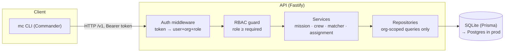
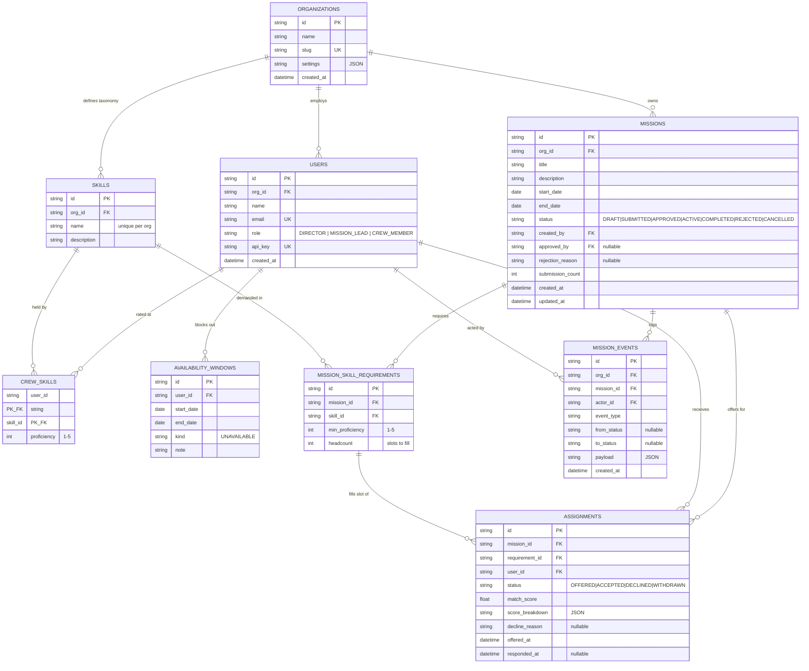
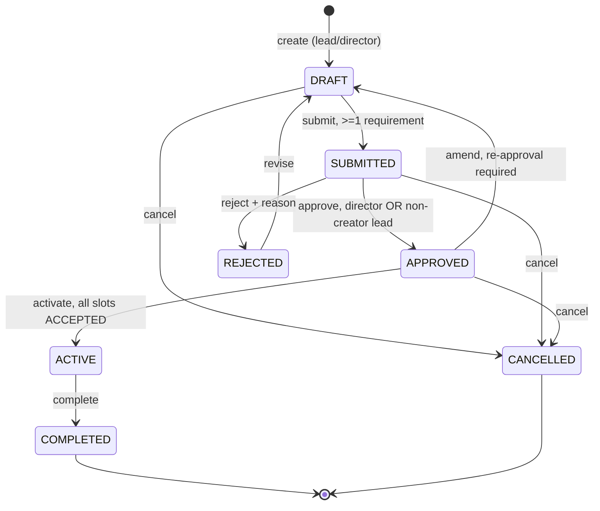
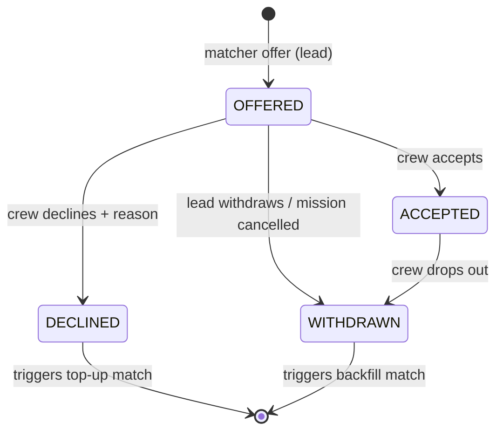
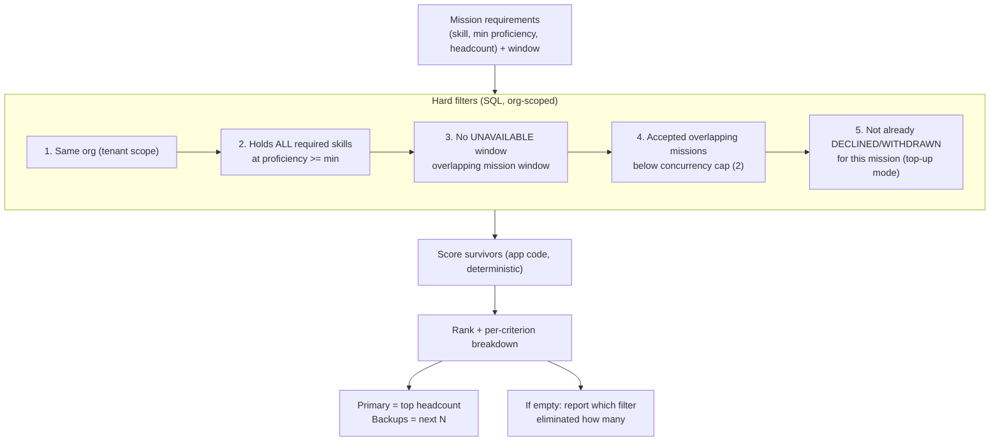

# Mission Control — Design Document

**Status:** Approved for implementation · **Date:** 2026-09-28 · **Audience:** Engineering team / AI coding agent

> Multi-tenant crew assignment platform for space organisations.

## 1. Problem Statement

Space organisations plan missions that require specific crew capabilities. Assignment today is manual and error-prone: mission leads cross-reference skill profiles, availability calendars, and existing commitments by hand. Multiple organisations will use this platform, each with different crew sizes, skill taxonomies, and approval processes.

**Mission Control** is the core of a multi-tenant B2B platform that lets an organisation manage its crew (skills, availability, history), plan missions with explicit skill requirements and timelines, get *explainable* crew suggestions from an auto-matching engine, move missions through an approval-gated lifecycle, and let crew respond to assignment offers — all exposed through a versioned API and a CLI, with strict tenant isolation and role-based access control enforced server-side.

## 2. Goals & Non-Goals

**Goals**

- Multi-tenant API with three roles (Director, Mission Lead, Crew Member), RBAC enforced server-side on every request.
- Mission lifecycle with an approval gate before activation, including rejection and amendment loops.
- Crew management: per-organisation skill taxonomy, proficiency ratings, availability windows, assignment history.
- Deterministic, explainable auto-matching engine (hard filters → weighted scoring → ranked suggestions with per-criterion breakdown).
- CLI through which every primary workflow can be exercised end-to-end.
- Seed data for two organisations proving tenant isolation and per-org taxonomies.
- Automated tests for the matcher, state machine, permissions, and cross-tenant isolation.

**Non-Goals (explicitly deferred)**

- Web interface (not required by brief).
- Notifications/email delivery — the CLI *is* the crew's inbox (`mc offers list`).
- Multi-org user memberships (a user belongs to exactly one org in this slice).
- OAuth/SSO, token rotation, password flows — seeded API tokens only.
- Equipment/resource constraints, configurable per-org approval chains — designed for, not built (see §17).

## 3. Tech Stack

| Layer | Choice | Why |
| --- | --- | --- |
| Language | TypeScript (Node 20+) | One language across API + CLI; shared domain types; discriminated unions make lifecycle transitions compile-time safe. |
| API framework | Fastify | Typed, fast, schema-first validation via zod; minimal ceremony. |
| ORM / DB | Prisma 6 + SQLite | Zero-infra local run (submission requirement); datasource swap to Postgres/Cloud SQL is the documented production path. |
| CLI | Commander | Standard, testable, subcommand tree mirrors the API. |
| Validation | zod | Single source of request schemas. |
| Tests | Vitest | Fast, TS-native, runs unit + integration against a throwaway SQLite file. |
| Packaging | Single npm package, `src/` by module | No monorepo overhead at this size; clear module boundaries instead. |

## 4. Decision Log

**D1 — TypeScript end-to-end.** API and CLI share domain types (mission status unions, DTOs). Lifecycle states are a discriminated union with exhaustive `switch` handling, so adding a state without handling it fails compilation. *Rejected:* Python — equally viable, but splits the type system between CLI and API and diverges from the hirer's primary stack.

**D2 — Per-organisation skill taxonomy via relational tables.** `skills` is org-scoped (each org defines its own taxonomy — a hard brief requirement). Proficiency lives on the `crew_skills` join (1–5). Mission demand lives on `mission_skill_requirements` (min proficiency + headcount). The matcher is plain SQL over indexed tables. *Rejected:* fixed skill enum (breaks per-org taxonomies); JSON blob on crew (unqueryable, no referential integrity, unindexable for matching).

**D3 — Single `users` table with hierarchical role enum.** `role ∈ {DIRECTOR, MISSION_LEAD, CREW_MEMBER}`, one per user per org. Hierarchy: DIRECTOR ⊃ MISSION_LEAD ⊃ CREW_MEMBER — permission checks ask "is role ≥ X". Crew-specific data lives in satellite tables keyed by `user_id`. *Rejected:* separate crew/lead/director tables — duplicates columns, complicates auth, makes inheritance awkward. A standalone `roles` lookup table adds a join for zero benefit over an enum at this size.

**D4 — Token auth; org always server-derived.** Seeded API tokens map to (user, org, role). Every request resolves the token; the org scope comes from the token, **never** from a client-supplied `orgId`. A crew member with only a token can act through the CLI with zero risk of cross-tenant leakage — no email/SSO system needed. *Production hardening (documented, not built):* hash tokens at rest, expiry, rotation, per-token scopes.

**D5 — Approval = Director OR non-creator Mission Lead.** The brief states leads "should not be able to approve their own missions" — read as separation of duties: leads *can* approve, never their own. Directors can approve anything. This ambiguity is intentional per the brief; the interpretation is recorded here. *Rejected:* directors-only approval — makes the brief's clause meaningless and creates a single-person bottleneck.

**D6 — Deterministic, explainable matcher over black-box ranking.** Hard filters in SQL, then a documented weighted score with per-criterion breakdown stored on every offer. A lead can always answer "why was I suggested / why not". Deterministic = testable = reviewable. *Rejected:* ML/embeddings — unjustifiable at this data scale, untestable in the time budget, and unexplainable to a customer.

**D7 — Slot-level repair, not mission-level restart.** A crew dropout after approval does **not** re-open the mission. The vacated slot is backfilled by top-up matching while the mission stays APPROVED/ACTIVE. Only material changes (dates, requirements) force re-approval via the amendment flow. Least disruption is the design goal.

**D8 — Audit log as a first-class table.** `mission_events` records every transition and offer action (actor, from→to, payload, timestamp). Feeds the CLI `mc missions history` view and the live-session discussion.

## 5. Architecture



- **Thin controllers, fat services:** HTTP layer validates (zod) and delegates; all rules live in services; all SQL lives in repositories.
- **Tenant isolation is structural:** repositories take `orgId` from the auth context as a mandatory parameter — there is no code path that queries without it.
- **CLI is a pure API client:** no business logic in the CLI; it renders tables/JSON and exits with meaningful codes.

## 6. Tenancy & Auth

- Every domain table carries `org_id`; every repository method requires it; an integration test attempts cross-tenant reads/writes and asserts 403/404.
- Auth: `Authorization: Bearer <token>` → resolves `{ userId, orgId, role }` into request context. Unknown token → 401.
- IDs are `cuid`s — unguessable, so cross-tenant probing by ID guessing fails even before the org filter (defence in depth, not a substitute for it).

## 7. Roles & Permissions

| Capability | Crew Member | Mission Lead | Director |
| --- | --- | --- | --- |
| Manage own profile, skills, availability | ✓ | ✓ | ✓ |
| View crew directory / skill profiles | own only | ✓ | ✓ |
| Manage org skill taxonomy | – | – | ✓ |
| Create / edit missions (DRAFT only) | – | ✓ | ✓ |
| Run matcher, send/withdraw offers | – | ✓ | ✓ |
| Submit mission for approval | – | ✓ | ✓ |
| Approve / reject mission | – | ✓ **not own** | ✓ |
| Activate / complete / cancel mission | – | ✓ | ✓ |
| Respond to own offers (accept/decline) | ✓ | ✓ | ✓ |
| View mission audit history | assigned missions | ✓ | ✓ |

Enforcement: `requireRole(MISSION_LEAD)` guard + resource-level checks (e.g. `mission.createdBy !== actor.id` for lead approval). All checks server-side; the CLI never gates, it only renders.

## 8. Data Model



**Notes**

- **Availability model:** crew are available by default; `availability_windows` records *unavailable* blocks (leave, training). The matcher also treats ACCEPTED overlapping assignments as committed load. Chosen over positive availability calendars because it matches the brief's language ("availability calendars, existing commitments") with the least data-entry burden.
- **Assignments reference the requirement slot** they fill — this is what makes slot-level backfill (D7) precise.
- **DECLINED/WITHDRAWN rows are never deleted** — they are the exclusion set for top-up matching and the input to the reliability score.
- **Key indexes:** `org_id` on every table; `skills (org_id, name)` unique; `crew_skills (skill_id, proficiency)`; `assignments (mission_id, status)`, `(user_id, status)`; `availability_windows (user_id, start_date, end_date)`; `missions (org_id, status)`.
- SQLite connector limitation: Prisma enums and Json columns are unsupported, so status/role fields are validated strings (TS unions + zod at the boundary) and JSON payloads are serialised strings.

## 9. Mission Lifecycle

`DRAFT` → `SUBMITTED` → `APPROVED` → `ACTIVE` → `COMPLETED`, with `REJECTED` → `DRAFT` and `CANCELLED` escape hatches.



| Transition | Actor | Guard (enforced in service, transactional) |
| --- | --- | --- |
| create → DRAFT | Lead+ | valid window (start < end), title required |
| DRAFT → SUBMITTED | Lead+ (creator) | ≥1 skill requirement; every requirement headcount ≥ 1; `submission_count += 1` |
| SUBMITTED → APPROVED | Director, or Lead where `actor ≠ created_by` | records `approved_by`; offers already OFFERED remain valid |
| SUBMITTED → REJECTED | same as approve | `rejection_reason` mandatory |
| REJECTED → DRAFT | creator | unlocks editing; history preserved in events |
| APPROVED → ACTIVE | Lead+ | every requirement's ACCEPTED count ≥ headcount; error lists the gaps otherwise |
| APPROVED → DRAFT (amend) | Lead+ | material changes only; ACCEPTED assignments retained; must re-pass approval before activation |
| ACTIVE → COMPLETED | Lead+ | — |
| any non-terminal → CANCELLED | Lead+ | open offers → WITHDRAWN in same transaction |

Editing a mission's fields/requirements is only possible in DRAFT. SUBMITTED is read-only pending decision — this is what makes approval meaningful.

## 10. Assignment Lifecycle



- Offers are created in **waves**: the matcher returns ranked candidates; the lead offers the top *k* per slot (primary + named backups). Backups are explicit offers, not a hidden queue — crew see exactly what they're being offered.
- Accept/decline is **idempotent**: only OFFERED → terminal transitions allowed; anything else → 409. Response recorded with `responded_at` and reason.
- A slot is **open** when `ACCEPTED count < requirement.headcount` — a derived value, never stored, so it can't drift.

## 11. Matching Engine



**Scoring** (weights are named constants, tunable in one place):

```
score = 0.40 · skillFit + 0.25 · workload + 0.20 · experience + 0.15 · reliability

skillFit    = avg over required skills of (proficiency / 5)
workload    = 1 − (committed mission-days in window / window days)    ∈ [0,1]
experience  = min(1, relevant completed missions / 5)
reliability = 1 − (lifetime declines / lifetime offers)    (new crew = 1.0)
```

Tie-break: higher skillFit → lower committed days → stable id order. Fully deterministic: same inputs, same ranking, every time.

**Worked example.** Mission "Europa Survey" requires **Orbital Navigation ≥ 4** and **EVA Ops ≥ 3**, window 2026-11-01 → 2026-11-30 (30 days), headcount 1 per skill.

| Candidate | skillFit | workload | experience | reliability | Score |
| --- | --- | --- | --- | --- | --- |
| Crew A — Nav 5, EVA 4; 0 committed days; 3 past missions; 0/2 declines | 0.90 | 1.00 | 0.60 | 1.00 | **0.880** |
| Crew B — Nav 4, EVA 3; 10 committed days; 5 past missions; 1/5 declines | 0.70 | 0.67 | 1.00 | 0.80 | 0.768 |

Crew A is offered primary; Crew B is the named backup. If A declines, top-up re-runs excluding A and offers B — no manual cross-referencing. (Illustrative; the seed data reproduces this scenario with real names.)

**Failure reporting.** When no candidate survives, the matcher returns the elimination funnel — e.g. `{ skillBar: 9, availability: 2, conflicts: 1, survivors: 0 }` — so the lead knows whether to lower the bar, shift the window, or split the requirement. Explainability includes explaining failure.

## 12. Edge Cases

**12.1 Mission rejected → revision loop.** REJECTED carries a mandatory reason; `revise` returns the mission to DRAFT with full history intact. Resubmission increments `submission_count`; the approver sees prior rejection reasons in the audit trail. No data is lost across the loop.

**12.2 Crew declines an offer → substitute wave.** The DECLINED row persists (exclusion + reliability input). Top-up matching re-runs with the declined user excluded and offers the next-ranked candidate for that specific slot. The mission itself is untouched.

**12.3 Crew drops out *after* approval → least-disruption backfill.** Assignment → WITHDRAWN. The mission stays APPROVED/ACTIVE; only the vacated slot re-opens (derived: ACCEPTED < headcount). Backfill offers for that slot do **not** require re-approval — the plan was already approved; a personnel swap within it is operations, not policy. Escalation path: if backfill finds no candidates, the lead amends the mission (APPROVED → DRAFT), which *does* force re-approval — material change, not a personnel swap.

**12.4 Also handled**

- **No eligible candidates:** elimination funnel returned (§11), never a silent empty list.
- **Double response:** second accept/decline → 409 (idempotency).
- **Mission cancelled with live offers:** all OFFERED → WITHDRAWN in the same transaction.
- **Approval of own mission by a lead:** 403 with explicit reason code `CANNOT_APPROVE_OWN`.
- **Cross-tenant access by ID guessing:** org filter + cuid IDs → 404 (not 403 — don't confirm existence).
- **Activation with open slots:** 422 listing exactly which requirements are under-filled.

## 13. API Surface

Base: `/v1` · Auth: `Authorization: Bearer <token>` · Errors: `{ error: { code, message, details? } }` with consistent codes.

| Endpoint | Role | Purpose |
| --- | --- | --- |
| `GET /v1/me` | any | Identity, org, role |
| `GET\|POST /v1/skills` · `DELETE /v1/skills/:id` | read: lead+ · write: director | Org skill taxonomy |
| `GET /v1/crew` · `GET /v1/crew/:id` | lead+ (crew: self) | Directory with skills/availability |
| `PUT /v1/me/skills` | any | Replace own skill ratings |
| `POST\|GET /v1/me/availability` · `DELETE /v1/me/availability/:id` | any | Own unavailable windows |
| `POST /v1/missions` · `GET /v1/missions` · `GET /v1/missions/:id` · `PATCH /v1/missions/:id` | lead+ (crew: assigned only) | CRUD; PATCH only in DRAFT |
| `PUT /v1/missions/:id/requirements` | lead+ | Replace requirement set (DRAFT only) |
| `POST /v1/missions/:id/submit \| approve \| reject \| activate \| complete \| cancel \| revise` | per §9 guards | Lifecycle transitions |
| `POST /v1/missions/:id/match` | lead+ | Run matcher → ranked candidates + breakdown (dry run) |
| `POST /v1/missions/:id/offers` | lead+ | Create offers from a match result (wave) |
| `GET /v1/me/offers` | any | My pending/responded offers |
| `POST /v1/assignments/:id/accept \| decline \| withdraw` | offer owner (withdraw: lead+) | Respond / drop out |
| `GET /v1/missions/:id/events` | lead+ (crew: if assigned) | Audit trail |

## 14. CLI

Binary `mc`. Config (token + API URL) in `~/.mission-control/config.json` via `mc login --token …`. Every command supports `--json`; human output is aligned tables. Non-zero exit codes on failure; errors print `code: message`.

```
mc login --token <token> [--api http://localhost:3000]
mc whoami

mc skills list | add <name> | remove <id>              # director for writes
mc crew list | show <id>

mc profile skills set <skill> <1-5> [...]
mc profile availability add <start> <end> [--note …]
mc profile availability list | remove <id>

mc missions create --title … --start … --end …
mc missions requirements set <id> --skill <name>:<min>:<count> [...]
mc missions list [--status …] | show <id> | history <id>
mc missions submit <id> | approve <id> | reject <id> --reason …
mc missions activate <id> | complete <id> | cancel <id> | revise <id>

mc missions match <id> [--top-up]             # ranked table + breakdown
mc missions offer <id> --crew <id> [...]      # send offer wave

mc offers list                                  # the crew member's inbox
mc offers accept <assignmentId>
mc offers decline <assignmentId> --reason …
mc offers withdraw <assignmentId>               # drop out post-acceptance
```

The demo script (README) walks: seed → lead builds mission → match → offer → submit → second lead approves → crew accepts → activate → dropout → top-up backfill → complete.

## 15. Seed Data

- **Two orgs** — "Astra Dynamics" and "Lunar Collective" — with **different skill taxonomies** (Orbital Navigation/EVA Ops/… vs Regolith Assay/Life Support/…; both define their own "Comms") to prove per-org scoping.
- Per org: 1 director, 2 mission leads, 8 crew with varied proficiencies, overlapping unavailable windows, and assignment history (completed missions feed the experience score).
- Missions pre-seeded in DRAFT, SUBMITTED, APPROVED and ACTIVE states so every CLI command has something to act on immediately.
- One seeded crew member with a decline history (reliability < 1) so score differences are visible in the demo.
- Printed token table on `npm run seed` — one line per user, copy-paste into `mc login`.

## 16. Verification Plan

| Layer | Tests (Vitest) |
| --- | --- |
| Matcher (unit) | Each hard filter in isolation; scoring formula against hand-computed values; tie-break determinism; empty-result funnel counts; top-up exclusions. |
| State machine (unit) | Every legal transition passes; every illegal one rejects (incl. lead-approves-own → 403); cancel withdraws offers transactionally. |
| RBAC (integration) | Each endpoint × each role → expected allow/deny matrix from §7. |
| Tenancy (integration) | Org A token cannot read/mutate any Org B resource by ID (404), cannot list across tenants, matcher never suggests cross-tenant crew. |
| Workflow (integration) | Full happy path end-to-end; decline→top-up; post-approval dropout→backfill; reject→revise→resubmit→approve. |
| CLI (smoke) | Each command against a live local server: exit codes + `--json` parseability. |

## 17. Extension Points (designed for, not built)

- **Resource/equipment constraints:** new `resources` + `mission_resource_requirements` tables; matcher gains a hard filter and the score a weight — no schema upheaval. (Anticipated live-session question.)
- **Per-org approval chains:** `organizations.settings.approval_policy` (e.g. two-director sign-off, auto-approve under N crew) evaluated in the approve guard.
- **Multi-org users:** split `users` into global users + `memberships(user_id, org_id, role)`; auth context already carries (user, org, role) as a tuple.
- **Postgres/GCP:** Prisma datasource swap; Cloud SQL + Cloud Run is the natural deployment.
- **Notifications:** an outbox row per offer event; a worker delivers email/webhooks. CLI polling remains the fallback.

## 18. Time Plan (3–5h budget)

| Block | Scope | Budget |
| --- | --- | --- |
| 1 | This design document | 0:30 |
| 2 | Repo scaffold, Prisma schema, migrations, seed | 0:45 |
| 3 | API: auth, RBAC, crew/skills, mission CRUD + lifecycle | 1:00 |
| 4 | Matcher + offers + assignment responses | 0:30 |
| 5 | CLI full command tree | 0:30 |
| 6 | Tests (matcher, state machine, RBAC, tenancy, workflow) | 0:45 |
| 7 | README (setup + demo script), commit hygiene, transcript export | 0:30 |
